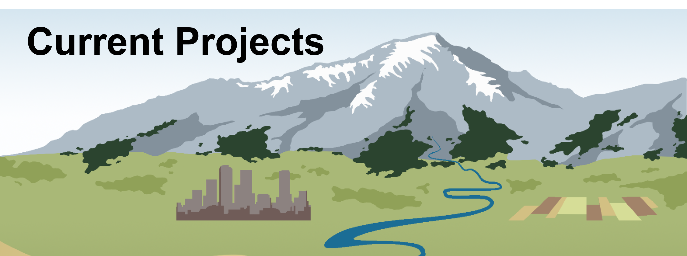

---
---
:::{.column-page}

:::
**Toward Improved SWE Mapping in Mid-Latitude Mountains Through the Integration of Snow Depth from Multiple Spaceborne LiDAR Instruments**\
*NASA Terrestrial Hydrology Program*\
June 2025 – May 2028\
\
**The utility of aerial LiDAR snow surveys to improve water supply forecasts across the western U.S.: comparing the relative importance of current snow conditions and future weather**\
*Bureau of Reclamation Snow Water Supply Forecast Program*\
October 2024 – September 2026\
\
**Does integration of airborne lidar with existing snow monitoring technologies improve water supply forecasts in the western United States?**\
*Bureau of Reclamation Snow Water Supply Forecast Program*\
October 2023 – September 2026\
\
**Development of a Colorado-Wide Data Assimilation System to Provide Snow Water Equivalent Data and Water Supply Forecasts to Water Managers**\
*NASA Water Resources*\
June 2022 – May 2025\
\
**Advancing the mapping of snow water equivalent with space ready remote sensing through snow model integration (CoI)**\
*NASA Terrestrial Hydrology*\
January 2022 – December 2024\

