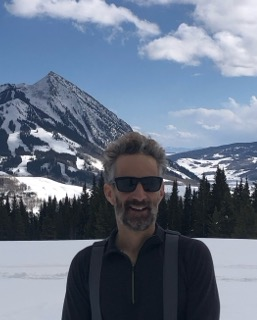

\usepackage{float}

:::{layout="[[70,30], [1]]".column-page}
My research is focused on the physical processes that control the water, energy, and carbon budgets of the Earth's land surface. Vegetation, soil, and the atmosphere strongly influence surface water fluxes and storage and therefore are monitored and modeled in this research. The processes I study act across a wide range of spatial and temporal scales, from the influence of plants on surface water redistribution and infiltration during rainstorms to the effects of land-atmosphere interactions on continental-scale rainfall anomalies. My research combines modeling and data analysis, with the latter combining measurements from the field, lab, and remote sensing.

{height=90%}
Professor of Earth Science at [CU Boulder](https://www.colorado.edu/geologicalsciences/)

[CV](EST_cv_feb_2025.pdf)

[Google Scholar](https://scholar.google.com/citations?user=co33aioAAAAJ&hl=en)

:::

\
\
\

::: {.column-page}

:::